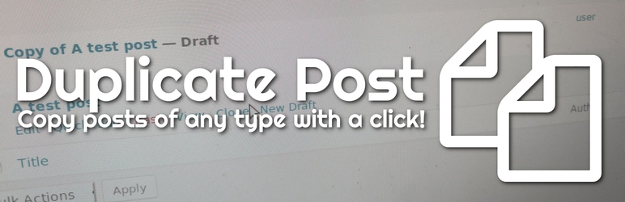

# Duplicate Post

       

> Duplicate Post plugin for WordPress https://duplicate-post.lopo.it/  

This WordPress plugin allows users to clone posts of any type, or copy them to new drafts for further editing.

This is the development repository: /src will be synced whit the [SVN repository](https://wordpress.org/plugins/duplicate-post/) on WordPress.org only on version releases.

If you find this useful, [**please consider donating**](https://duplicate-post.lopo.it/) whatever sum you choose, **even just 10 cents**. Just a few cents from every user would help me develop the plugin and improve support.

- [Install](#install)
- [Usage](#usage)
- [API](#api)
- [Maintainer](#maintainer)
- [Thanks](#thanks)
- [Contributing](#contributing)
- [License](#license)

## Install

### Automatic install from WordPress Dashboard

1. Click on Plugins → Add New;
2. Search for "Duplicate Post" using the top right searchbox;
3. Click on the "Install Now" button;
4. Click on "Activate";
5. Go to Settings → Duplicate Post and customize behaviour as needed.

### Install using zipfile

1. Download the archive from https://wordpress.org/plugins/duplicate-post/ (latest stable) or the latest snapshot build from the "build" directory;
2. Unzip the archive on your computer;
3. Upload the `duplicate-post` directory into the `/wp-content/plugins/` directory;
4. Activate the plugin through the 'Plugins' page in WordPress Dashboard;
5. Go to Settings → Duplicate Post and customize behaviour as needed.

## Usage

1. In 'Edit Posts'/'Edit Pages', you can click on 'Clone' link below the post/page title: this will immediately create a copy and return to the list.
2. In 'Edit Posts'/'Edit Pages', you can select one or more items, then choose 'Clone' in the 'Bulk Actions' dropdown to copy them all at once.
3. In 'Edit Posts'/'Edit Pages', you can click on 'New Draft' link below the post/page title.
4. On the post edit screen, you can click on 'Copy to a new draft' above "Cancel"/"Move to trash" or in the admin bar. 
5. While viewing a post as a logged in user, you can click on 'Copy to a new draft' in the admin bar.

3, 4 and 5 will lead to the edit page for the new draft: change what you want, click on 'Publish' and you're done.

There is also a **template tag**, so you can put it in your templates and clone your posts/pages from the front-end. Clicking on the link will lead you to the edit page for the new draft, just like the admin bar link.

## API

For functions, template tags and hooks refer to the [Developer's Guide](https://duplicate-post.lopo.it/docs/developers-guide/) on the plugin's website.

##  Maintainer

- Enrico Battocchi (Lopo) 
  - [Website](https://lopo.it)
  - [WordPress.org](https://profiles.wordpress.org/lopo/)
  - [GitHub](https://github.com/enricobattocchi)
  - [Twitter](https://twitter.com/lopo)
  
## Thanks

- Thanks to all the people who have supported Duplicate Post by [donating some money](https://duplicate-post.lopo.it/donate/)
- Thanks to [JetBrains](https://www.jetbrains.com/?from=DuplicatePost) for supporting Duplicate Post with an Open Source license for their tools. 
  
## Contributing

If you find this useful and if you want to contribute, there are three ways:

   1. You can [write me](https://duplicate-post.lopo.it/contact) and submit your bug reports, suggestions and requests for features;
   2. You can also [submit a pull request](https://github.com/enricobattocchi/duplicate-post/pulls); 
   3. If you want to translate it to your language (there are just a few lines of text), you can use the [translation project](https://translate.wordpress.org/projects/wp-plugins/duplicate-post);
   4. Using the plugin is free, but if you want you can support my efforts by donating with PayPal [here](https://duplicate-post.lopo.it/donate)
  
## License

[GPL v2.0 © Enrico Battocchi](LICENSE)