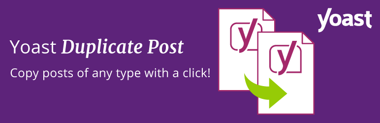

# Yoast Duplicate Post

> Duplicate Post plugin for WordPress https://yoast.com/wordpress/plugins/duplicate-post/

This WordPress plugin allows users to clone posts of any type, or copy them to new drafts for further editing.

This document addresses the GitHub repository. WordPress.org uses the [readme.txt file](readme.txt).

- [Install](#install)
- [Usage](#usage)
- [API](#api)
- [Maintainer](#maintainer)
- [Contributing](#contributing)
- [License](#license)

## Install

### Automatic install from WordPress Dashboard

1. Click on _Plugins_ → _Add New_;
2. Search for "Duplicate Post" using the top right searchbox;
3. Click on the _Install Now_ button;
4. Click on _Activate_;
5. Go to _Settings_ → _Duplicate Post_ and customize behaviour as needed.

### Install using zipfile

1. Download the archive from https://wordpress.org/plugins/duplicate-post/ (latest stable) or the [latest snapshot ZIP](https://github.com/Yoast/duplicate-post/archive/main.zip) from GitHub;
2. Unzip the archive on your computer;
3. Upload the `duplicate-post` directory into the `/wp-content/plugins/` directory;
4. Activate the plugin through the _Plugins_ page in WordPress Dashboard;
5. Go to _Settings_ → _Duplicate Post_ and customize behaviour as needed.

## Usage

1. In _Edit Posts_/_Edit Pages_, you can click on _Clone_ link below the post/page title: this will immediately create a copy and return to the list.
2. In _Edit Posts_/_Edit Pages_, you can select one or more items, then choose _Clone_ in the _Bulk Actions_ dropdown to copy them all at once.
3. In _Edit Posts_/_Edit Pages_, you can click on _New Draft_ link below the post/page title.
4. On the post edit screen, you can click on _Copy to a new draft_ above _Cancel_/_Move to trash_ or in the admin bar. 
5. While editing a post or viewing it as a logged-in user, you can click on _Copy to a new draft_ in the admin bar.

3, 4 and 5 will lead to the edit page for the new draft: change what you want, click on 'Publish' and you're done.

There is also a **template tag**, so you can put it in your templates and clone your posts/pages from the front-end. Clicking on the link will lead you to the edit page for the new draft, just like the admin bar link.

## API

For functions, template tags and hooks refer to the [Developer's Guide](https://developer.yoast.com/duplicate-post/) on our developer site.

##  Maintainer

The Duplicate Post plugin was created by Enrico Battocchi ([Lopo](https://lopo.it)). It's maintained by Team Yoast, of which Enrico is now a part.
  
## Contributing

If you find this useful and if you want to contribute, there are three ways:

   1. You can submit your bug reports, suggestions and requests for features [on GitHub](https://github.com/Yoast/duplicate-post/);
   2. You can also [submit a pull request](https://github.com/Yoast/duplicate-post/pulls); 
   3. If you want to translate it to your language (there are just a few lines of text), you can use the [translation project](https://translate.wordpress.org/projects/wp-plugins/duplicate-post);
  
## License

[GPL v2.0 © Yoast BV](LICENSE)
